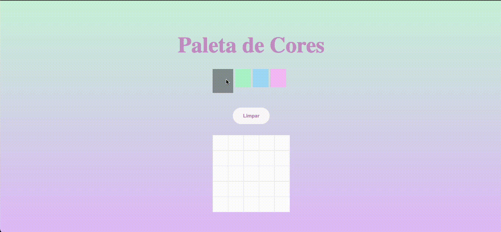

# Pixels Art 🖌️

Esse é um projeto desenvolvido durante o módulo de Fundamentos na [Trybe](https://www.betrybe.com/), em que utilizamos os conhecimentos de como manipular o DOM com JavaScript para criar uma página interativa.

## Skills desenvolvidas

* Desenvolvimento com HTML, CSS e JavaScript;
* Manipulação do DOM para acessar elementos HTML;
* Criar interatividade em página utilizando event listeners.

## Ferramentas utilizadas

* HTML5
* CSS3
* JavaScript ES6+